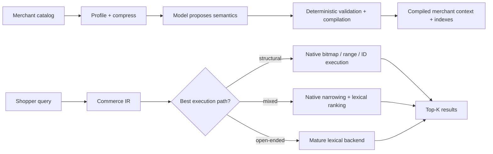
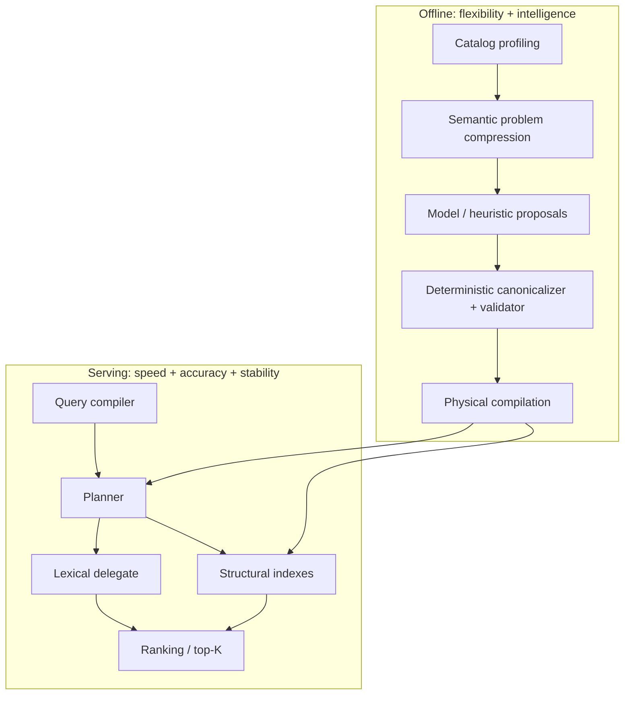

# Commerce-Native Search

A research prototype asking one core question:

> **Can an ecommerce search engine be faster, more flexible, more accurate, and more stable at the same time?**

Not by putting a bigger model in every query. The hypothesis is that merchant-specific intelligence can be learned **offline**, compiled into deterministic commerce-aware structures, and then served through a small predictable runtime.

In this project:

- **Faster** means less CPU/latency for the commerce workloads that can use specialized execution.
- **More flexible** means new merchants, categories, schemas, variants, and relationships should not require new serving code.
- **More accurate** means structural specialization must preserve or improve retrieval correctness/relevance — speed obtained by dropping good results does not count.
- **More stable** means deterministic installed semantics and predictable serving behavior even when catalogs are messy and model proposals are stochastic.

The project has evidence for each piece, but has **not yet proved all four simultaneously end to end**. That is the research program.



## What the research has actually shown

| Goal | Current evidence |
|---|---|
| **Faster** | Structural execution can be dramatically cheaper than generic retrieval, but only in measured workload regions. Faceting also showed that the right physical algorithm matters more than language/runtime alone. |
| **More flexible** | A dynamically discovered merchant schema can compile into the same physical operators as hand-written code without meaningful hot-path overhead in the tested case; mixed/unseen synthetic catalogs did not require vertical-specific serving branches. |
| **More accurate** | The project rejected the original whole-engine replacement thesis because mature lexical ranking was better. The current design delegates open-ended relevance and only promotes specialized paths when correctness/relevance survives explicit gates. |
| **More stable** | LLM proposals are useful but stochastic. Deterministic validation/canonicalization substantially reduces that instability and prevents confirmed unsafe promotions; adaptive consensus is the current research frontier. |

A few representative measurements, with full caveats preserved in the decision records:

- Real-catalog experiments reached **1.2M products** and a **22,458-query judged corpus**.
- WANDS ordinal faceting beat Solr at every tested point in the 1x–20x controlled scale ladder (**2.5x–72.6x**, depending on checkpoint).
- E2b feature discovery: **LLM + deterministic validator macro F1 0.7697 vs. 0.5366** for statistics-only.
- E2c: true raw full-descriptor agreement was **74.96%**; deterministic canonicalization raised it to **95.20%** for a single-proposal reading and **100%** for the measured ensemble reading. The experiment still concluded **REVISE**, not GO.
- Multi-tenant pooling looked economically promising in steady state, but rebuild churn and a shared lexical backend produced real tail-latency isolation gaps that became worse/more reliable under correlated bursts.

## The architecture being tested

The structural serving pieces are real `commerce-core` code. The general model-assisted compilation/consensus path is still experimental and is being validated before any productionization decision.



The boundary is deliberate: **models propose; deterministic code decides what may be installed; serving stays model-free.**

## What this is not

- Not a production search service.
- Not a claim that Rust is generally faster than Lucene.
- Not an Elasticsearch-compatible document engine or query DSL.
- Not an attempt to rebuild mature lexical ranking from scratch.
- No LLM call in the normal query hot path.
- No claim that one specialized execution path should handle every query.
- No distributed serving, sharding, HA, or Kubernetes work until the single-node thesis requires it.

## What is being tested now

The active control-plane experiment is **[Issue #47](https://github.com/yangjeep/simple-ecommerce-search-engine/issues/47)**:

> **How much model do we actually need once semantic compilation is deterministic?**

It tests adaptive consensus first, then freezes the controller and measures a model capability/cost frontier. A separate follow-up, **[#51](https://github.com/yangjeep/simple-ecommerce-search-engine/issues/51)**, keeps the remaining typed-ambiguity serving question independent from that experiment.

## Repository map

- [`crates/commerce-core/`](crates/commerce-core/) — the actual engine/domain code.
- [`docs/README.md`](docs/README.md) — documentation map; start here for anything deeper than this page.
- [`docs/architecture/`](docs/architecture/) — current implementation and component boundaries.
- [`docs/decisions/`](docs/decisions/) — terminal/interim research decisions, chronologically preserved.
- [`docs/experiments/`](docs/experiments/) — protocols and append-only experiment logs.
- [`docs/research/`](docs/research/) — papers, archaeology, economic models, and exploratory research.
- [`docs/adr/`](docs/adr/) — architectural decisions.
- [`benchmarks/`](benchmarks/) + [`artifacts/`](artifacts/) — reproducibility manifests and archived outputs.

## Build / test

```bash
cargo fmt --all -- --check
cargo clippy --workspace --all-targets --all-features -- -D warnings
cargo test --workspace --all-features
cargo build --workspace --release
```

Most real-data experiments need their documented external datasets/services; the exact setup lives with the corresponding experiment log/manifest rather than in this README.

## Read next

- **Why this architecture exists:** [`docs/WHY.md`](docs/WHY.md)
- **What is product code vs. experiment code:** [`docs/WHAT.md`](docs/WHAT.md)
- **How the current system works:** [`docs/architecture/README.md`](docs/architecture/README.md)
- **Full evidence history:** [`docs/decisions/README.md`](docs/decisions/README.md)
