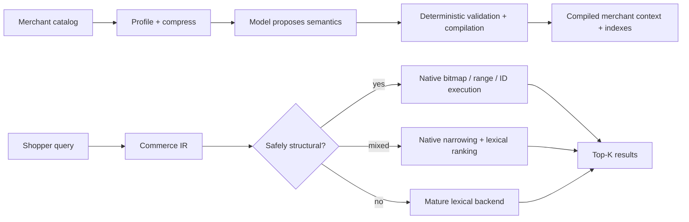
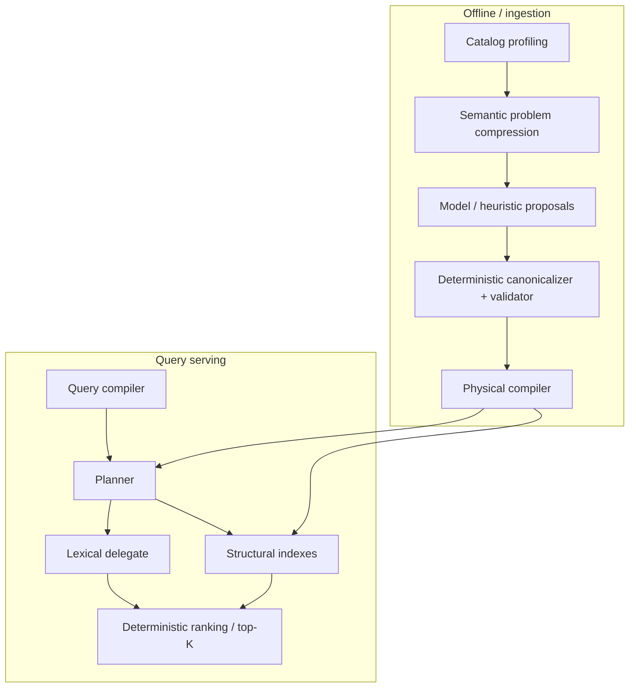

# Commerce-Native Search

A research prototype for one question:

> **Can ecommerce search do less work by understanding commerce structure before query time?**

The current answer is: **sometimes, and only if the system stays narrow.**

This project keeps a small deterministic serving path for commerce-native work — typed filters, ranges, identifiers, faceting, variant constraints — and delegates open-ended lexical relevance to a mature search backend. An offline model can help interpret a merchant's catalog, but it never gets to make live query decisions or directly choose production data structures.



## What the research has actually shown

| Finding | Current conclusion |
|---|---|
| **Structural execution** | Real and often very fast, but conditional. It is not a universal replacement for Lucene/Solr/Elasticsearch-style retrieval. |
| **Faceting** | Algorithm choice matters more than language/runtime. The ordinal implementation beats Solr across the tested WANDS scale ladder, while simpler scan methods have real crossovers. |
| **Dynamic merchant schemas** | A schema discovered offline can compile to the same physical operators as hand-written code without meaningful hot-path overhead in the tested case. |
| **Identifiers and residual text** | Dedicated identifier lookup and a compiled residual-token policy both survived adversarial testing and are now part of `commerce-core`. |
| **LLM-assisted catalog understanding** | Useful, but not trusted. LLM + deterministic validation materially beats a statistics-only floor; raw model outputs remain unstable enough that deterministic canonicalization/consensus is still an active research problem. |
| **Multi-tenant economics** | Pooling is promising under normal load, but rebuild churn and shared lexical-backend contention create real tail-latency isolation gaps, amplified during correlated bursts. |

A few representative measurements, with the full caveats preserved in the decision records:

- Real-catalog experiments reached **1.2M products** and a **22,458-query judged corpus**.
- WANDS ordinal faceting beat Solr at every tested point in the 1x–20x controlled scale ladder (**2.5x–72.6x** depending on the checkpoint).
- E2b feature discovery: **LLM + deterministic validator macro F1 0.7697 vs. 0.5366** for statistics-only.
- E2c: true raw full-descriptor agreement was **74.96%**; deterministic canonicalization raised it to **95.20%** for a single-proposal reading and **100%** for the measured ensemble reading. The experiment still concluded **REVISE**, not GO.

## The current architecture



The important boundary is simple: **models propose; deterministic code decides what may be installed; serving stays model-free.**

## What this is not

- Not a production search service.
- Not a claim that Rust is generally faster than Lucene.
- Not an Elasticsearch-compatible document engine or query DSL.
- Not an attempt to rebuild BM25 or general lexical relevance from scratch.
- No LLM call in the normal query hot path.
- No distributed serving, sharding, HA, or Kubernetes work until the single-node thesis requires it.

## What is being tested now

The active control-plane experiment is **[Issue #47](https://github.com/yangjeep/simple-ecommerce-search-engine/issues/47)**:

> **How much model do we actually need once semantic compilation is deterministic?**

It tests adaptive consensus first, then freezes the controller and measures a model capability/cost frontier. A separate follow-up, **[#51](https://github.com/yangjeep/simple-ecommerce-search-engine/issues/51)**, keeps the remaining typed-ambiguity serving question independent from that experiment.

## Repository map

- [`crates/commerce-core/`](crates/commerce-core/) — the actual engine/domain code.
- [`docs/README.md`](docs/README.md) — documentation map; start here for anything deeper than this page.
- [`docs/architecture/`](docs/architecture/) — current implementation and component boundaries.
- [`docs/decisions/`](docs/decisions/) — terminal/interim research decisions, chronologically preserved.
- [`docs/experiments/`](docs/experiments/) — protocols and append-only experiment logs.
- [`docs/research/`](docs/research/) — papers, archaeology, economic models, and exploratory research.
- [`docs/adr/`](docs/adr/) — architectural decisions.
- [`benchmarks/`](benchmarks/) + [`artifacts/`](artifacts/) — reproducibility manifests and archived outputs.

## Build / test

```bash
cargo fmt --all -- --check
cargo clippy --workspace --all-targets --all-features -- -D warnings
cargo test --workspace --all-features
cargo build --workspace --release
```

Most real-data experiments need their documented external datasets/services; the exact setup lives with the corresponding experiment log/manifest rather than in this README.

## Read next

- **Why this architecture exists:** [`docs/WHY.md`](docs/WHY.md)
- **What is product code vs. experiment code:** [`docs/WHAT.md`](docs/WHAT.md)
- **How the current system works:** [`docs/architecture/README.md`](docs/architecture/README.md)
- **Full evidence history:** [`docs/decisions/README.md`](docs/decisions/README.md)
