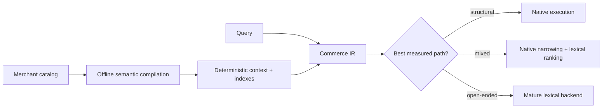
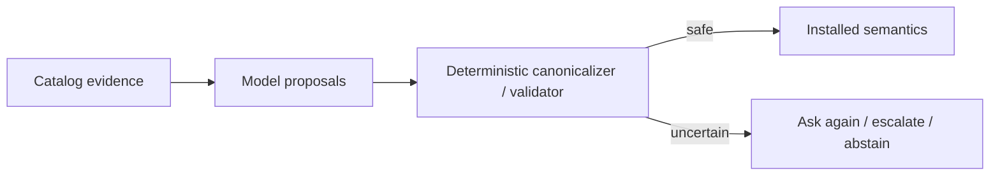

# Why this project exists

The core research question is deliberately ambitious:

> **Can an ecommerce search engine be faster, more flexible, more accurate, and more stable at the same time?**

Those goals usually fight each other. Generic engines buy flexibility with generic abstractions. Highly specialized engines buy speed by narrowing what they understand. Model-heavy systems can buy semantic flexibility while introducing cost and nondeterminism. This project is testing whether ecommerce structure creates a better tradeoff.

The working hypothesis is:

> Learn merchant-specific semantics offline, compile them into deterministic commerce-aware structures, and keep query serving small, predictable, and free of model calls.

That gives four independent bars the system has to clear:

- **Faster** — lower CPU/latency on meaningful ecommerce workload classes, not benchmark tricks.
- **More flexible** — previously unseen merchant schemas, categories, variants and relationships should compile without bespoke serving code.
- **More accurate** — specialization must preserve or improve retrieval correctness/relevance; a fast wrong answer is a failure.
- **More stable** — installed semantics and serving behavior should remain deterministic/predictable even when source catalogs are messy and model proposals vary.

The research has not yet proved all four together. It has, however, eliminated several weaker versions of the idea and made the remaining architecture much more specific.

## The thesis that survived

A commerce request often contains two kinds of work:

1. **Structural work**: exact identifiers, category membership, variant constraints, enum filters, ranges, faceting, availability.
2. **Open-ended relevance work**: lexical matching, ranking, spelling, vague intent, semantic/occasion queries.

The current design specializes the first class where measurements justify it and delegates the second to a mature lexical engine. Merchant-specific semantic interpretation happens before serving rather than being rediscovered on every query.

## What changed the original idea

### 1. “Replace the whole search engine” failed the accuracy/complexity test

Realistic evaluation showed mature Lucene/Solr relevance and memory behavior were too strong to justify rebuilding general lexical search. The project therefore stopped treating fallback as temporary technical debt.

This was a useful failure: **accuracy is a first-class requirement, not something speed is allowed to trade away.**

### 2. Speed comes from the right physical representation, not from Rust alone

Bitmap/range/facet execution can be dramatically cheaper, but operator and cardinality matter. Several phases found genuine crossovers. Phase 6D then showed that switching from naive scan-style faceting to ordinal/dictionary counting removed the earlier color-facet crossover across the tested WANDS scale ladder, while finding a different small-candidate limit for already-cheap typed-ID facets.

The lesson is: **specialize only inside a measured win region.**

### 3. Flexibility belongs in compilation, not the hot path

Issue #38 tested whether arbitrary merchant fields require a runtime-generic schema. The successful compiled-schema treatment showed they do not have to: offline discovery/compilation could feed the same physical bitmap operators as hand-written code without meaningful serving overhead in the tested case.

That is the flexibility thesis in concrete form:

> merchants may be heterogeneous; the serving plane should not have to be.

### 4. LLM flexibility is useful only if deterministic machinery absorbs its instability

Issue #42 showed actual model-assisted feature discovery beating a statistics-only floor, but raw proposal stability was insufficient and real Product/Variant/relationship external validity remained open.

Issue #45 then showed deterministic canonicalization could move full-descriptor agreement from 74.96% raw to 95.20% under the stricter single-proposal reading and 100% under the measured ensemble design, with zero confirmed unsafe accepted classifications. The verdict was still REVISE because the stricter stability bars were not fully met.

So the model is now treated as a **proposal engine**, not the schema authority:

The active Issue #47 tests whether this design also makes model size less load-bearing: can cheap models handle easy semantic problems while harder ones escalate selectively?

## Why this might be a useful system

If the four-part thesis holds, the durable asset is not a particular model or benchmark trick. It is the combination of:

- a compact commerce domain / IR;
- deterministic profiling and semantic problem compression;
- validated, versioned merchant context;
- physical compilation into efficient serving structures;
- mature fallback for workloads specialization should not own;
- explicit safety/accuracy gates;
- measured rules for when to specialize and when to abstain.

That combination is what could plausibly deliver **speed without rigidity, flexibility without hot-path intelligence, accuracy without rebuilding Lucene, and stability despite stochastic models.**

## What remains uncertain

Important open gaps remain:

- real Product/Variant and relationship-rich external validation for learned catalog semantics;
- typed ambiguity resolution without query-time catalog scans (#51);
- historical Phase 9 reproducibility re-audit after a Tantivy determinism fix (#43);
- mutable-state concurrency and restart durability (#11/#12);
- broader methodology generalization across unseen verticals (#35).

For the exact evidence trail, see [`decisions/README.md`](decisions/README.md). For implementation details, see [`architecture/README.md`](architecture/README.md).
