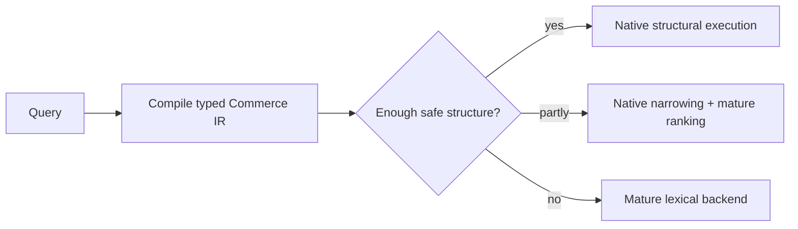
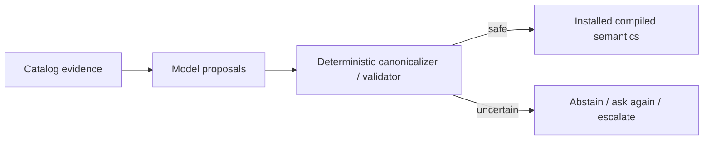

# Why this project exists

Generic search engines are very good at generic search. This project started by asking whether ecommerce has enough repeated structure — products, variants, categories, identifiers, ranges, availability, facets — to justify doing some requests with much smaller deterministic data structures instead of sending everything through general lexical retrieval.

The research did **not** support building “a faster Elasticsearch in Rust.” It supported a narrower system.

## The thesis that survived

A commerce request often contains two different kinds of work:

1. **Structural work**: exact identifiers, category membership, variant constraints, enum filters, ranges, faceting, availability.
2. **Open-ended relevance work**: lexical matching, ranking, spelling, vague product intent, semantic/occasion queries.

Trying to make one engine reinvent both is unnecessary. The current architecture specializes only where commerce structure measurably reduces work and delegates the rest.

## What changed the original idea

### 1. General lexical search was not the differentiator

On realistic data, mature Lucene/Solr relevance and memory behavior were too strong to justify rebuilding a general search engine. The project narrowed to structural execution + planning rather than treating fallback as temporary technical debt.

### 2. Native wins are conditional, not universal

Bitmap/range/facet execution can be dramatically cheaper, but operator and cardinality matter. Several phases found real crossovers. Phase 6D then showed that changing the facet algorithm to ordinal/dictionary counting can eliminate the earlier color-facet crossover across the tested WANDS scale ladder — while also finding a different small-candidate crossover for already-cheap typed-ID facets.

The lesson is not “native always wins.” It is **measure the physical region where a specific representation wins, then plan accordingly.**

### 3. Merchant schema flexibility belongs before serving

Issue #38 tested whether dynamically discovered features require a generic runtime schema. They do not have to: the successful compiled-schema treatment used offline discovery/compilation but reached the same hot-path allocation count and physical bitmap behavior as the hand-written path in the tested case.

That is the important boundary: merchants can be heterogeneous; the serving plane should not be.

### 4. LLMs are useful, but should have less authority

Issue #42 showed LLM-assisted feature discovery materially outperforming a statistics-only baseline, while also exposing stability and external-validity gaps. Issue #45 then showed that deterministic canonicalization can absorb much of the model's raw instability.

The architecture therefore treats the model as a **proposal engine**:

The model does not directly choose physical structures or bypass safety checks, and no normal query path calls an LLM.

## The system-level bet

If this works, the durable value is not a particular model. It is:

- a compact commerce domain / IR;
- deterministic profiling and semantic problem compression;
- validated, versioned merchant context;
- physical compilation into cheap serving structures;
- safe admission/fallback rules;
- accumulated evidence about when to specialize and when not to.

The active Issue #47 tests the next implication: **if deterministic compilation absorbs stochasticity, can a cheap/small proposal model handle most fields and escalate only the genuinely hard semantic cases?**

## What remains uncertain

The research still has important gaps:

- real Product/Variant and relationship-rich external validation for learned catalog semantics;
- typed ambiguity resolution without query-time catalog scans (#51);
- historical Phase 9 reproducibility re-audit after a Tantivy determinism fix (#43);
- mutable-state concurrency and restart durability (#11/#12);
- broader methodology generalization across unseen verticals (#35).

Those are open because the project preserves negative or incomplete evidence instead of converting promising measurements into a product claim.

For the exact evidence trail, see [`decisions/README.md`](decisions/README.md). For the implementation, see [`architecture/README.md`](architecture/README.md).
