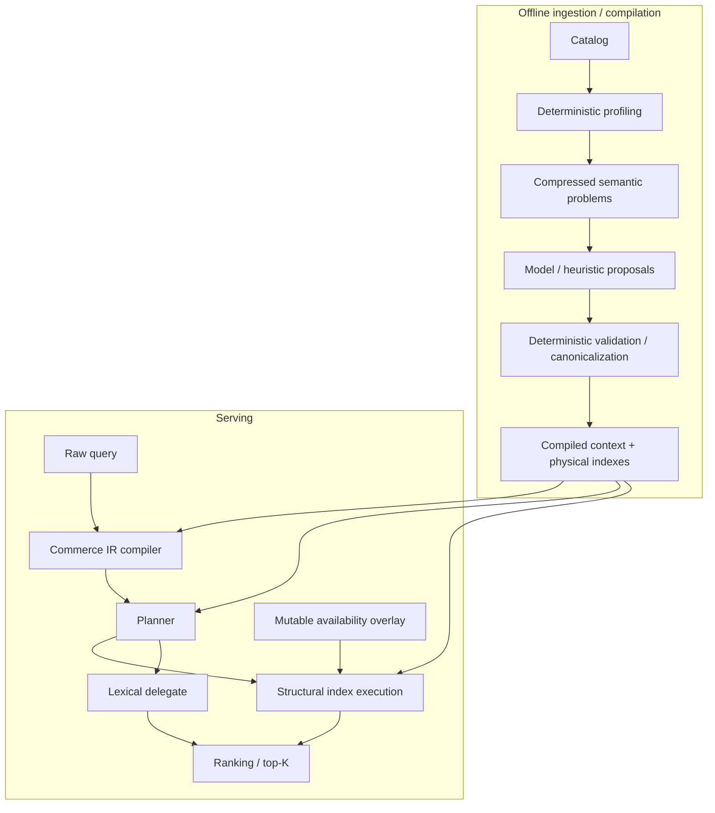

# Architecture

This page describes what exists in `main` now. Experimental treatments that have not been promoted are called out explicitly.

## End-to-end shape


```mermaid
flowchart TB
    subgraph Ingestion[Offline ingestion / compilation]
        C[Catalog] --> P[Deterministic profiling]
        P --> X[Compressed semantic problems]
        X --> M[Model / heuristic proposals]
        M --> V[Deterministic validation / canonicalization]
        V --> B[Compiled context + physical indexes]
    end

    subgraph Query[Serving]
        Q[Raw query] --> IR[Commerce IR compiler]
        IR --> PL[Planner]
        PL --> SI[Structural index execution]
        PL --> LD[Lexical delegate]
        SI --> RK[Ranking / top-K]
        LD --> RK
        O[Mutable availability overlay] --> SI
    end

    B --> IR
    B --> PL
    B --> SI
```

The project enforces one architectural rule throughout: **semantic flexibility is resolved before or around compilation; query serving should stay deterministic and context-light.**

## 1. `commerce-core`

`crates/commerce-core` is the engine. Evaluation crates do not become dependencies of it.

Its major responsibilities are:

- `domain` — Product/Variant and typed attribute concepts;
- `ir` — query compilation into typed Commerce IR;
- `index` — bitmap/range/facet/identifier physical structures;
- `plan` — native/delegate composition;
- `admission` — conservative routing decisions;
- `control_plane` — offline proposal/replay/promotion primitives;
- `state` — mutable availability overlay.

## 2. Query compilation and ambiguity

The compiler resolves known commerce phrases into structural constraints and preserves residual lexical text. Ambiguous meaning is not supposed to become a hard filter merely because one interpretation exists.

Historical experiments found several real compiler-resolution defects; the current baseline includes the corrections that survived RED-test/adversarial-review cycles. One typed-ambiguity performance question remains isolated in Issue #51.

## 3. Physical indexes

The serving path uses specialized structures rather than a universal document schema.

### Bitmaps and typed structural constraints

Enum-like values and typed IDs use compact IDs / Roaring bitmaps. Variant-safe matching is handled by typed constraints rather than ad-hoc string filtering.

### Numeric/range

Numeric constraints use typed numeric structures rather than lexical token matching.

### Faceting

The code contains both scan-style and ordinal/dictionary counting families. Phase 6D is important because it changed the interpretation of earlier facet results: the old crossover was primarily a property of the naive scan algorithm, not a fundamental limit of commerce-native faceting. The ordinal method beat Solr across every tested WANDS scale-ladder checkpoint for the color case, while typed-ID facets still showed a small-candidate crossover because ordinal counting has a fixed dictionary-reset cost.

Issue #79 (E3b, ADR 0014) added a third counting method, `facet_counts_bitmap`: per-value `intersection_len`, with no intermediate bitmap and no per-value key allocation. It also added a small deterministic per-facet rule, `index::sort::choose_facet_path`: bitmap counting iff `|C_f| >= tau * V_f`, with `tau` calibrated on held-out-separated WANDS cells, and ordinal otherwise. The rule never routes a `MultiEnum` attribute to the ordinal column. On 516k WANDS docs, against the preregistered (as-run) baseline, it reaches parity with Meilisearch for low/medium-cardinality full-catalog facets. It stays 2.9x slower for high-cardinality (color, V = 2825) full-catalog counting and 1.28x slower on the disjunctive 5-facet cell. A post-review like-for-like sensitivity (Meilisearch's 100-value facet cap removed) and host drift leave the competitive position **unresolved**; see `ISSUE79_FACET_SORT_RECOVERY_DECISION.md` §11.

Issue #63 (Infra E3 amended, ADR 0015) then ran the equal-work, same-window confirmation #79 asked for. Every engine returned complete facet counts, checked exactly against an oracle, in a counterbalanced Latin square. Native FINAL was at parity on FH1/FH2 and a material advantage on FH3 (0.70) and FH4 (0.51) against Meilisearch, the fastest equal-work competitor. All of these cells are full-catalog-shaped: FH4's cost is its self-excluded full-catalog color facet, and no category-scoped facet cell was measured. The FH3/FH4 margin over Solr depends on Solr's bucket-return configuration (decision §7). #63 also found that full-catalog candidate materialization (`all_ordinals()`, per-element insertion) cost 4.5 ms hot-loop and 12–13 ms in the server per match-all. `CatalogIndex::all_ordinals_bitmap_by_range` (P0r) builds the identical bitmap 270x cheaper, and with it every FH cell is a material advantage (0.10–0.43). P0r is available as `cand_mode=p0r` and is not yet the `indexed_candidates` default. The logical `CandidateSet::All` plus dense full-catalog facet paths are exact but not adopted. See `ISSUE63_PRIMITIVE_EFFICIENCY_DECISION.md`.

There is still no universal cost-based runtime chooser that selects every physical implementation optimally from measured cardinality. The #79 rules cover only facet counting and single-field numeric sort.

### Numeric sort

`index::sort` (Issue #79, ADR 0014) provides bounded single-numeric-field sort with one defined order: present values first, value asc/desc, ties by variant ordinal ascending, NaN treated as missing. There are two physical strategies:

- `top_k_scan` reads an optional dense `NumericSortColumn` (8 B/variant/field) with a bounded heap;
- `top_k_presorted` walks the index's pre-existing value-sorted `numeric_index` and membership-tests the candidate bitmap, with a missing-value tail from an optional `PresenceBitmap`.

`choose_sort_path` picks presorted iff `|C|^2 >= rho * k * N`. This is not a general sort-expression engine, and neither structure is built by `CatalogIndex::build`: callers opt in, so their memory is accounted separately.

### Identifier dictionary

Issue #42 promoted `IdentifierClassifier` / `IdentifierDictionary` after the dedicated primitive outperformed variant-level lexical indexing on the measured exact-lookup/adversarial workload. Classification is statistics-based, not field-name-based.

## 4. Native + lexical execution

`commerce_core::plan::LexicalDelegate` keeps mature lexical retrieval outside the structural engine.

The planner can execute:

- **FastPath** — native-only structural execution;
- **Hybrid** — structural narrowing plus lexical ranking;
- **Punt** — lexical backend first, followed by native verification where required.

Issue #42 added an optional compiled residual-token policy so residual words can be classified as required/preferred/contextual/unknown instead of always acting as a hard veto. Existing call sites can still pass `None` and preserve prior behavior.

The concrete lexical/search baselines live in evaluation crates. `commerce-core` deliberately does not depend on Solr, Elasticsearch or OpenSearch.

## 5. Dynamic merchant schema compilation

Issue #38 tested the hot-path cost of compiling a merchant-discovered schema into physical structures.

The naive generic tuple-key design was measurably slower because it allocated strings during lookup. A redesigned per-field compiled map removed that cost: the successful treatment matched the hand-coded path's allocation count and met the preregistered serving-overhead gate.

The architectural conclusion is narrow but important: **merchant schema variability does not require runtime-generic serving.** Ingestion can discover/compile a field into a concrete physical operator before queries arrive.

## 6. Learned semantic proposals

Issue #42's E2b provided the first actual model-assisted feature-discovery evidence. The model produced useful semantic descriptors but failed the raw repeated-stability gate and lacked real Product/Variant/relationship-rich external validation.

Issue #45 then tested deterministic canonicalization. It established two useful things:

1. raw model wording/primitive choices should not own the installed schema;
2. deterministic rules can absorb a large part of proposal instability without unsafe promotion.

The E2c canonicalizer is still an experimental/evaluation boundary, not a production service. Issue #47 tested adaptive consensus and model capability/cost before any productionization decision and concluded REVISE on both halves (closed; no architecture GO) — see `docs/decisions/README.md`'s chronology for the surviving, non-#47 findings this project keeps building on.

### Semantic promotion lifecycle (Issue #55 A1/A2)

`compile_lexicon`'s syntactic candidates (e.g. `product_type_hyponym_groups`, a whole-word `ProductType` hyponym-expansion mechanism structurally identical to `BrandAny`) are a **candidate relation**, never installed as serving semantics on their own. The required lifecycle is:

```text
candidate relation (syntactic, from catalog vocabulary)
→ deterministic validation / adjudication
→ PROMOTE / REJECT / UNRESOLVED
→ only a recorded PROMOTE verdict may install a hard ProductTypeAny route
```

`commerce_core::control_plane::hyponym_promotion` (`HyponymRelation`/`PromotedHyponyms`) implements this, reusing `implication.rs`'s existing Candidate/Promoted/Withdrawn lifecycle rather than inventing a parallel one. `compile_lexicon`'s public signature is unchanged, but its default promoted set is empty: **current production has zero active hyponym expansions** by default. This closes a real defect where an unvalidated relation shipped as a hard default filter (`"beds"` admitting the confirmed cross-family false positive `"cat beds"`/`"dog beds & mats"`).

A separate, auditable promotion oracle (`issue55-eval`'s `i55_a2_promotion_oracle` binary) has adjudicated the full 149-group/317-pair live candidate set — 113 pairs PROMOTE (two independent category-hierarchy evidence sources agree), 2 REJECT (the known-bad pairs, explicit override), 136 unreachable (moot), the rest UNRESOLVED (safe fallback) — with zero known false promotions, verified two ways. **This oracle's output is not yet wired into a live `SemanticContext`**; until it is, production stays at zero active expansions regardless of the oracle's own findings. Wiring it in is the named next step, not yet done.

`ProductTypeAny`'s own evidence boundary, disclosed rather than assumed: it is a leaf-only, bag-of-words whole-term match (not hierarchy-aware), which closes the three confirmed cross-family false positives found by dedicated audits except one residual, disclosed risk class (`"beds"` → pet-products-style relations, which the promotion gate now excludes by construction for the two known instances, but the underlying mechanism itself remains bag-of-words, not semantically hierarchy-aware). Treat `ProductTypeAny` as a validated-relation admission gate, not a general synonym/taxonomy engine.

## 7. Mutable commerce state

`CommerceStateOverlay` keeps variant availability separate from immutable semantic/index state and composes through query execution. This avoids rebuilding semantic structures for every OOS event.

Known limitations are intentionally tracked separately:

- #11 — coarse `RwLock` concurrency;
- #12 — no restart durability/replay.

## 8. Multi-tenant findings vs. multi-tenant product code

Phase 7/8 evaluation crates measured packing/pooling, noisy-neighbor and correlated-burst behavior. Those results are evidence about the target operating model, **not proof that `commerce-core` contains a production tenant scheduler or isolation subsystem**.

The important measured boundary is that pooled in-process native querying behaved well in steady state, while index rebuilds and a shared lexical backend created real cross-tenant tail-latency interference; correlated bursts amplified those known gaps.

## 9. What is still experimental or absent

- E2c/E2d adaptive learned compilation is not installed as production control-plane behavior (Issue #47 closed REVISE; no GO).
- The Issue #55 A2 hyponym promotion oracle's PROMOTE verdicts are not yet wired into a live `SemanticContext` — production has zero active `ProductTypeAny` hyponym expansions until that wiring lands.
- No real Product/Variant/relationship-rich external dataset has yet closed the learned-schema external-validity gap.
- No generic cost-based planner covers every measured operator crossover.
- No production Solr/Elasticsearch/OpenSearch adapter lifecycle or service API exists.
- No durable mutable-state log/snapshot mechanism.
- No distributed serving / HA / sharding / replication.

That boundary is deliberate. The repository adds product machinery only when a falsifiable experiment shows it is needed.

## 10. Evaluation-harness fairness (not engine architecture, but load-bearing for every benchmark claim above)

Every native-vs-Solr comparison this project cites depends on the evaluation harness asking Solr the *same* question native answers — a structural constraint native enforces (e.g. `ProductTypeAny`, `Brand`) must translate into an equivalent Solr `fq`, and a Solr transport/parse failure must never be scored as a relevance loss. Two independent audits (Issue #55 A3) found both failure modes shipped live in eval binaries at various points: a missing `fq` translation arm for a newly-introduced constraint kind, and a `None`-on-failure collapsed into a scored `NDCG=0.0`. `crates/comparator-eval` now centralizes hardened transport (a 4-way success/transport-error/query-error/parse-error outcome) and an exhaustive constraint-to-`fq` translator behind a small trait boundary designed for Issue #57's Elasticsearch/Havenask adapters to reuse. Migration is not yet complete across every eval binary in the workspace — see `docs/decisions/ISSUE55_COMPARATOR_CENTRALIZATION_DECISION.md` for exactly which binaries were fixed and which remain named, disclosed follow-up.
